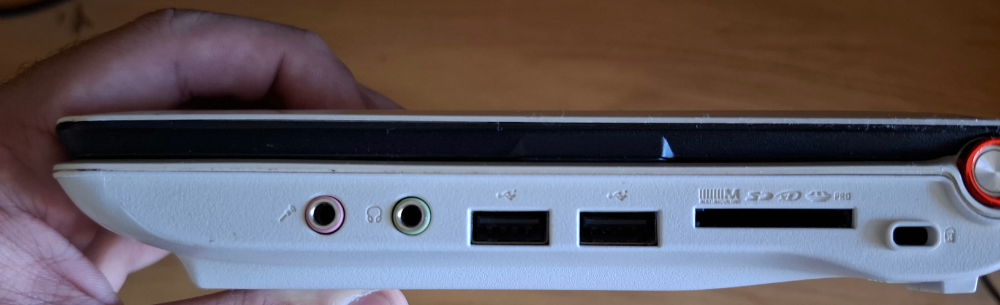

## Introduction

I picked up an Acer Aspire ZG5 netbook from my local flea market back in the summer. When I first tried to turn on the machine,
it appeared dead so I put it back in a cabinet and forgot about it. Recently I tried to test the laptop to see if
it magically got resurrected, and to my great surprise, the machine actually worked! It turns out that the power suppy I
originally used to test it was not powering the machine on, and the machine came back to life. This blog post will be about the
machine that unexpectedly brightened my weekend.

## Hardware/Ports overview


The left side of the machine contains a barrel jack for power, a VGA port, an Ethernet port, a USB port and an SD card reader.
The SD card reader is labeled "Storage Expansion" on the palmrest. Once inserted to this slot, the SD card sits flush
to the chassis, and the slot is not spring-loaded so it is very hard to take the card out. Since this slot is labeled "Storage Expansion",
I don't know if this is intentional or the mechanism on my machine failed. (**Update:** After putting the laptop in my bag, this slot became spring loaded on my machine).


On the front side, we only have a switch to turn on/off the WiFi connectivity.



On the right side, there is a Kensington lock, *ANOTHER* card reader, two more USB ports and audio jacks. It is kind
of sad that a 2008 netbook has more USB ports and card readers than my current laptop.

Running `inxi -F` from Linux reports the following hardware:

```
System:
  Host: chiyo Kernel: 6.1.0-26-686-pae arch: i686 bits: 32 Desktop: LXDE
    v: 0.10.1 Distro: BunsenLabs GNU/Linux 12 (Boron)
Machine:
  Type: Other-vm? System: Acer product: AOA150 v: 1
    serial: <superuser required>
  Mobo: Acer model: N/A serial: <superuser required> BIOS: Acer v: 0.3305
    date: 05/09/2008
Battery:
  ID-1: BAT1 charge: 8.1 Wh (68.6%) condition: 11.8/23.8 Wh (49.8%)
    volts: 11.1 min: 10.8
CPU:
  Info: single core model: Intel Atom N270 bits: 32 type: MT cache:
    L2: 512 KiB
  Speed (MHz): avg: 798 min/max: 800/1600 cores: 1: 798 2: 798
Graphics:
  Device-1: Intel Mobile 945GSE Express Integrated Graphics driver: i915
    v: kernel
  Device-2: Suyin Acer CrystalEye Webcam type: USB driver: uvcvideo
  Display: x11 server: X.Org v: 1.21.1.7 driver: X: loaded: intel
    unloaded: fbdev,modesetting,vesa dri: i915 gpu: i915
    resolution: 1024x600~60Hz
  API: OpenGL v: 2.1 Mesa 22.3.6 renderer: i915 (: 945GME)
Audio:
  Device-1: Intel NM10/ICH7 Family High Definition Audio driver: snd_hda_intel
  API: ALSA v: k6.1.0-26-686-pae status: kernel-api
  Server-1: PulseAudio v: 16.1 status: active
Network:
  Device-1: Realtek RTL810xE PCI Express Fast Ethernet driver: r8169
  IF: enp2s0 state: down mac: [REDACTED]
  Device-2: Qualcomm Atheros AR242x / AR542x Wireless Network Adapter
    driver: ath5k
  IF: wlp3s0 state: up mac: [REDACTED]
Drives:
  Local Storage: total: 178.35 GiB used: 30.4 GiB (17.0%)
  ID-1: /dev/mmcblk0 model: SDU1 size: 29.3 GiB
  ID-2: /dev/sda vendor: Western Digital model: WD1600BEVT-22ZCT0
    size: 149.05 GiB
Partition:
  ID-1: / size: 37.18 GiB used: 17.24 GiB (46.4%) fs: ext4 dev: /dev/sda5
Swap:
  ID-1: swap-1 type: partition size: 998 MiB used: 268.5 MiB (26.9%)
    dev: /dev/sda6
Sensors:
  System Temperatures: cpu: 53.0 C mobo: N/A
  Fan Speeds (RPM): N/A
Info:
  Processes: 168 Uptime: 7h 50m Memory: 985.4 MiB used: 647.2 MiB (65.7%)
  Shell: Zsh inxi: 3.3.26
```

I didn't take any photos when I disassembled my system, but [this disassembly guide](https://www.instructables.com/Acer-Aspire-One-A-Guide-to-Dismantling/) at instructables contains photos of the disassembly process.


## Operating systems: Windows XP


The first OS I went with Windows XP, the operating system that the computer shipped with. The computer actually booted to an
XP installation, but the account was password protected and the hard drive seemingly died on me. While I was
experimenting with booting off one of the SD card slots on the machine, the hard drive returned to life and I
could install Windows on it. (By the way, you can't boot from the card slots on this machine, so plan accordingly.)

When I was searching for drivers, I found the recovery partition on archive.org here: [https://archive.org/details/acer-aspire-one-zg-5-recovery-partition](https://archive.org/details/acer-aspire-one-zg-5-recovery-partition). I didn't use this ISO but you might
give it a try if you also have this netbook. I found the driverscape website to be extremely helpful with regards to drivers.
I got all my drivers except sound and graphics working. I resorted to using IOBit driver booster to get the graphics
drivers. The Realtek audio drivers required installing an additional driver for a chipset component through Device Manager. I found most of the exact versions of software I used from this website, which has a list of software working on Windows XP: [https://skipster1337.github.io/posts/windows-software.html](https://skipster1337.github.io/posts/windows-software.html)


One of the first programs I installed after sorting the driver situation out was "Kasuga Ayumu's Mail Order Life", also 
known as "Osaka Simulator". I had to change my locale to Japanese to install the program, which is the reason for
the yen symbol sometimes replacing the backslash in the XP screenshots.


It is kind of ironic that the so-called "net"books and similar older hardware struggles the most with the modern web.
I tried a few browsers (MyPal, Thorium etc.) and settled on using New Moon, a fork of Pale Moon which is a fork of old
Firefox. Since it is based on older code, it's not as memory hungry as more modern browsers. Websites utilizing a lot
of recent features would run horribly on this class of machine anyways, and the older Firefox aesthetic is more fitting
to this machine IMO. You can download the weekly release of New Moon [here](https://rtfreesoft.blogspot.com).

[The person providing the New Moon downloads](https://rtfreesoft.blogspot.com) also provides downloads for Mailnews, a fork of old Thunderbird. It works for
a standard IMAP/SMTP mail setup with SSL/TLS, but I can't put a screenshot here due to privacy reasons.


Here is Chiyo-chan browsing the Wikipedia page for the Asus EeePeeCee.


Obligatory llama-whipping with Winamp 5.666 and some heavy metal.


The latest version of Java that can run on XP is Java 8, which is perfect for older Java applications.


Speaking of which, here is a screenshot of the latest release of Mars, a MIPS simulator running on Chiyo. Here it is simulating some
assembly program I wrote a few years ago for my computer organization course. MARS hasn't been updated for a decade
at this point, and the program sometimes doesn't render properly on newer machines, especially Macs. It is kind of
funny that this 16 year old machine runs this program better than most computer people use MARS on nowadays.


While most people nowadays use their web browser to view PDFs, loading the web browser every time you want to view a PDF is really inefficient in this type of computer. 
Adobe provides (or provided, since I visited the page through Wayback Machine) downloads and serial codes for their Creative Suite 2 since the activation servers shut down. 
The installer refused to run on this machine because of the screen resolution being lower than 1024x768 (I ran it anyway by hooking up an external monitor). 
Adobe also provided downloads for the full version of Acrobat 7, which is a perfectly usable PDF viewing/annotating software even today. 


I installed Office 2007, the oldest version that uses the current MS Office document formats. The program works pretty
well on this computer and I could open recently made Word documents without any problems whatsoever.


To my surprise, the latest version of PuTTY at the time of writing this post still supported Windows XP! I could SSH into modern Linux servers without any problems. 
I found PuTTY pretty redundant on modern versions of Windows (at least for SSH) since modern Windows ships with an SSH client out of the box, and the terminal itself looks kind of dated nowadays, 
but it is very useful on an XP machine like this.


Notepad++, a very useful text editor for Windows that I install on all Windows machines, works on Windows XP. In fact, I used it to write the intro and most of the Windows XP portion of this post. 


Here is Osaka simulator running as a screensaver (The "small" resolution made the screensaver crash so I bumped it up to 800x600, the "middle" resolution).


This screen appears after you lock your computer or put it to sleep. I didn't know that XP displayed the description/"pretty name" for your computer on this screen if it was set 
(perhaps because I never bothered to set that back in the day).

## Operating systems: Bunsenlabs (a Debian-based distro)


Although it is a pretty fun experiment to test what one can do on XP nowadays, it's much more reasonable to run a lightweight Linux distro on this type of hardware rather than searching "$PROGRAM\_NAME windows xp" on your favorite search engine. Bunsenlabs is my favorite Linux distro to use on old/underpowered x86 hardware. It is a lightweight Debian-based distro that provides support for not only 32-bit machines, but also provides kernels for old CPUs that don't support Physical Address Extension (PAE). I used it on a 2003 Thinkpad R50e (for the lolz) and a Pentium 4 desktop from around the same era (to see if we could use that machine for distance learning back in 2020, Zoom provided a 32-bit client back then and the machine could almost browse the modern web, but Zoom was unusably slow so we put that machine back into storage). I took 40GB off of my Windows partition and installed Bunsenlabs to dual-boot with Windows.


Bunsenlabs comes with the Openbox window manager and the tint2 panel. I installed LXDE to get a more traditional desktop experience. LXDE might look a little dated but I think the look suits the machine. LXDE uses the same window manager, so the resource consumption isn't that different. I might actually put i3 or my build of dwm on here, but I will use a non-tiling WM for now for aesthetic reasons. 


Some people like to say "Linux is only free if you don't value your time". For this machine, the inverse is true. Every device driver worked out of the box, no digging around old forum posts required. The graphics and audio drivers took quite some fiddling to install on XP, but they just worked on this machine. Here's the output of lspci to accompany this paragraph.   


Although Firefox ESR works on this machine, using Pale Moon provides a much better browsing experience since the browser is lighter (I resort to using Dillo much less often now that I installed Pale Moon). Installing uBlock Origin is a must in these underpowered machines because you can't afford to waste any precious bytes of RAM or CPU cycles on beaming 50 million advertisements directly at your eyeballs.


As expected, you can use modern versions of SSH and any other command line tools. Also you can run a modern version of the Linux kernel with all the security fixes instead of NT 5.1 Swiss Cheese Edition in 2024.


Obligatory neofetch screenshot. 


Claws Mail is a lightweight mail client that works with a bog-standard IMAP+SMTP mail confiugration.


You can get videos off of YouTube via yt-dlp. The most miserable part of this experience is to search the videos on YouTube, as the UI is quite taxing on this little machine. I experienced some frame drops on locally playing 720p video but 480p worked mostly fine. Side note: the webm videos are more susceptible to audio and video going out of sync compared to mp4 or mkv.


As expected, both hugo (the static site generator used to build this very page)  and texlive are available in Debian repos. This means I could actually build and publish the site from this device.


Aside from Firefox, Bunsenlabs also came with Dillo, an extremely lightweight web browser that has no support for JavaScript. I fiddled with the configuration a bit to modify the UI to my liking. It works with older websites or with FrogFind, which is an excellent website for old browsers/computers. In my opinion, Dillo can be used strategically on a machine like this to visit non-interactive websites without bogging the system down with modern web shenanigans. Here's it displaying the biography of Michael Jordan from the Space Jam website and the homepage of FrogFind).


LXDE came with XScreenSaver, which came with this fun screensaver (although not as fun as "Osaka Simulator")


This computer can run mGBA mostly without stuttering. Here it's running Azumanga Daioh Advance, which is available on the Internet Archive. I originally intended to get this screenshot in XP, but couldn't get mGBA or VisualBoyAdvance working on it so I just installed mGBA from the Debian repos. 


Two hours of compiling Rust dependencies later, we can run spotifyd and spotify-tui to stream music on this machine.


I originally intended to edit the photos in this blog on Photoshop 9, but I am more accustomed to GIMP (said no one ever). GIMP was perfectly adequate for some color correction and downscaling of the photos I took with my phone.

## Conclusion (for now)
In conclusion, this machine actually working was a pleasant surprise and I had (and continue to have) a lot of fun tinkering with it. On top of that, I actually got some work done on this 
machine since I got it working (using Office and SSHing into servers, and of course, writing this post). If I didn't need to use JavaScript-heavy web apps for communication, 
I could actually live off of this device (having this laptop would be immensely useful back in May 2023, where my previous laptop spontaneously stopped working in the middle of a million 
programming assignments and other responsibilities. I resorted to using Overleaf on my phone paired with a Bluetooth keyboard and borrowing my groupmates' computers for group assignments). 
One last surprise was the battery started to hold a charge after I left the machine plugged in overnight. The cells are still heavily worn, so I might re-cell the battery in the future (
It would be really funny if this thing ended up having a better battery life compared to my daily driver once it gets new cells). Bumping the RAM to 1.5 gigs and getting an SSD would also be 
pretty sweet if I come across them. Lastly, I really like this form factor. This is the first and only computer I own that isn't awkward to use on a train. I bet some mad hacker with much 
superior electronics skills than me could build a motherboard for this thing that supports a compute module (I don't think any large OEM would make a device like this in this day and age, 
at least not with enough ports and **TWO SD CARD READERS**). I am looking forward to their work popping up on Hackaday or YouTube.
